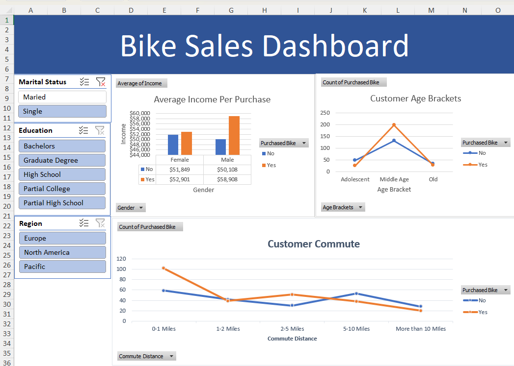
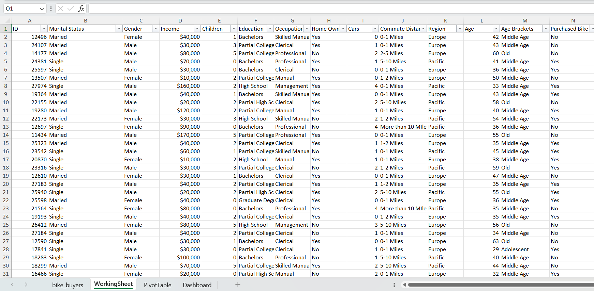
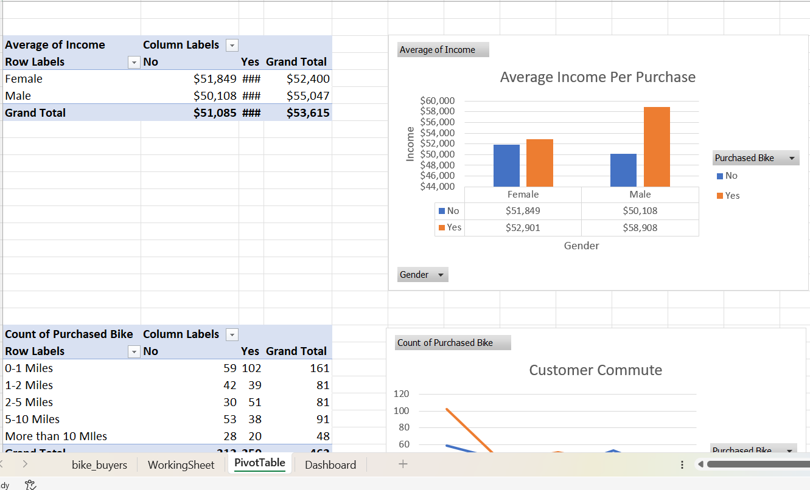
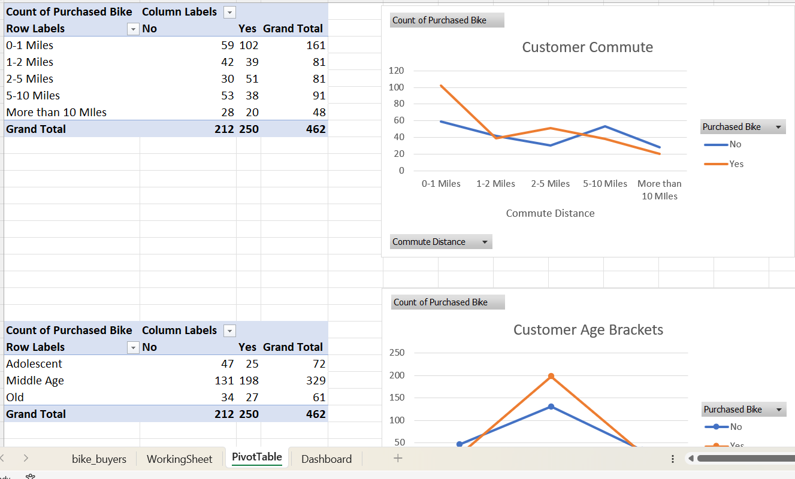
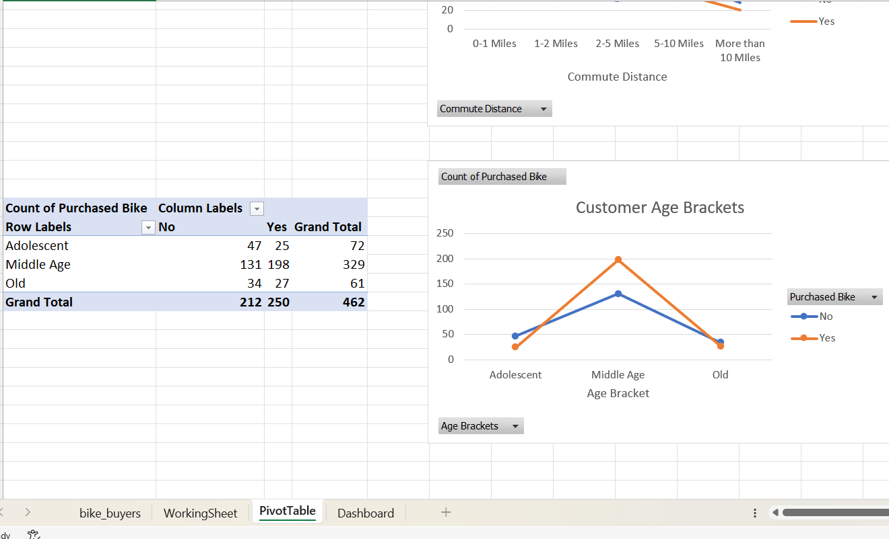

# Bike Sales Analysis Dashboard

## Overview
This Excel project analyzes customer demographics and purchasing behavior to identify the key factors that influence bike purchase decisions. Using data cleaning, analysis, and visualization techniques in Microsoft Excel, the project transforms raw customer data into actionable business insights.

The dashboard provides an interactive view of customer trends, enabling stakeholders to better understand purchasing patterns based on demographic and socioeconomic factors such as income, age, education, occupation, and commute distance.

---

## Project Objectives
- Analyze customer demographics and purchasing behavior.
- Identify factors that influence bike purchase decisions.
- Explore relationships between income, age, occupation, and bike purchases.
- Create an interactive dashboard for business analysis.
- Support data-driven marketing and sales strategies.

---

## Tools & Techniques Used
- **Microsoft Excel**
- Formulas & Functions
- Pivot Tables
- Pivot Charts
- Data Cleaning & Preparation
- Interactive Dashboard Design
- Data Visualization

---

## Dashboard Features

### Key Analysis Areas
- Bike Purchases by Income Level
- Bike Purchases by Age Group
- Bike Purchases by Education Level
- Bike Purchases by Occupation
- Bike Purchases by Commute Distance
- Customer Demographic Insights

### Interactive Features
- Dynamic Filters (Slicers)
- Interactive Charts
- Pivot Table Analysis
- Dashboard Navigation

---

## Data Preparation
The dataset was prepared and organized using Excel tools, including:

- Removing duplicates
- Handling missing or inconsistent data
- Standardizing data formats
- Creating calculated fields
- Categorizing age groups and customer segments
- Preparing data for pivot table analysis

---

## Key Insights
The dashboard helps answer important business questions such as:

- How does income affect bike purchasing behavior?
- Which age groups are most likely to purchase bikes?
- What occupations have the highest purchase rates?
- Does commute distance influence purchasing decisions?
- How do education levels relate to bike purchases?
---

## Dashboard Preview

---
## Data Preview

---
## Pivot Tables Preview

---

## Skills Demonstrated
- Data Cleaning
- Data Analysis
- Excel Formulas & Functions
- Pivot Tables
- Dashboard Development
- Data Visualization
- Business Analytics
- Customer Behavior Analysis

---

## Business Value
This project enables businesses to better understand their customer base and purchasing behavior. By identifying the demographic and socioeconomic factors that influence bike purchases, organizations can develop more targeted marketing campaigns, improve customer segmentation, and make data-driven business decisions.

---

## Author

**Ahmad Abdallah**

Data Analyst | Business Intelligence Enthusiast

- GitHub: https://github.com/AhmadAbdallahMujahid?tab=repositories
- LinkedIn: https://www.linkedin.com/in/ahmad-abdallah-9662942a0/?skipRedirect=true
